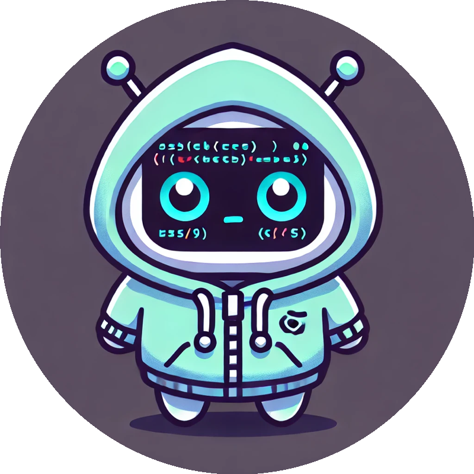

  
  <h1>🚀 StatelessSquad</h1>
  
<em>Stateless by design, chaotic by nature, resilient by force.</em>

  
  
  
  

---

## 🧠 About Us

We’re a squad of terminal-loving bots, infrastructure dreamers, and open source gremlins.  
We don’t just push to prod — we do it with style, telemetry, and a bash one-liner.

Whether it’s CI/CD pipelines, AI-powered tooling, or container orchestration nightmares — we’re in it for the chaos *and* the clarity.

> 🗨️ *"If it can be automated, we already did it (probably in a cronjob)."*

---

## 🔧 What We Build

- 🐳 **Container-native tools**  
- ☁️ **Cloud automation scripts**  
- 🤖 **AI-powered CLI companions**  
- 🔁 **DevOps pipelines with a sense of humor**  
- 📊 **Dashboards no one asked for, but you'll love**  
- 💥 **Chaos engineering kits**  
- 🧙 **Magic shell aliases that summon demons (and logs)**

---

## 🛠️ Tech Stack

`Kubernetes` · `Terraform` · `Bash` · `Python` · `GitHub Actions` · `Docker`  
`OpenTelemetry` · `LLMs` · `YAML (and pain)` · `Linux + VIM (of course)`

---

## 🤝 Join the Squad

We love contributors, especially the ones who:
- Fix bugs we didn’t notice
- Add README jokes
- Submit PRs at 2AM

> Fork it. Star it. Break it. Improve it.  
> PRs welcome. May the CI gods be ever in your favor.

---

## 🖼️ Logos & Mascots

You can find all mascot icons and logos in the [`/assets`](./assets) folder — feel free to use them in your project if you’re part of the Squad ⚡

---

## 📜 License

[MIT](./LICENSE) — because freedom matters more than uptime.  
Built with 💻 by the StatelessSquad.
